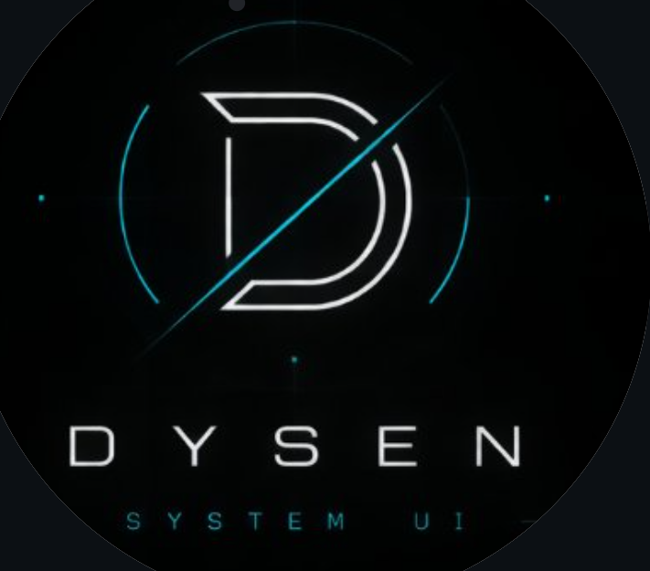

  

  <strong>A terminal-first Linux interface for people who live in the command line.</strong>

  Organize terminals. Navigate projects. Explore your system. Customize your workspace. 
  And build with NEXUS, DYSEN's inbuilt AI assistant.

  <a href="https://github.com/harshitn06/DYSEN_UI">GitHub</a>

---

# DYSEN

**DYSEN** is a terminal-first Linux UI designed to make powerful terminal workflows feel more organized, visual, accessible, and human-friendly.

DYSEN began as an experiment in creating a futuristic computer interface and evolved into a Linux-focused terminal environment with its own visual language, panel system, system integration, geographic explorer, sound system, customization, and an inbuilt AI assistant called **NEXUS**.

The idea is simple:

> Linux gives you enormous control. DYSEN is about making that control easier to navigate without taking away the terminal mindset.

DYSEN is **not a traditional desktop replacement**.

It is a work-in-progress terminal-first Linux environment for people who spend real time with Linux, terminals, projects, files, development tools, and system workflows.

---

# ✦ What Makes DYSEN Different?

A normal Linux workflow can involve jumping between:

DYSEN explores a more connected workflow:

The interface is designed around the idea of keeping useful tools close to the work instead of treating every workflow as a separate application.

---

# 🚀 Current Status

**DYSEN is actively under development.**

The GitHub repository represents the current public development baseline.

Some components are already usable, while other components are still experimental or being rebuilt.

The current development focus includes:

- DYSEN core UI
- Terminal workflows
- Panel system
- File/project access
- Globe Explorer
- Themes
- Sounds and ambient BGM
- Settings
- Linux system integration
- NEXUS AI backend
- Developer-focused AI assistance
- Permission-aware AI actions

---

# ⚡ First Time Using DYSEN

## 1. Open your terminal

First go to your home directory:

Your Linux home directory normally looks like:

## 2. Enter DYSEN

For a local development checkout:

## 3. Start DYSEN

DYSEN will launch its full-screen interface.

---

# 🧭 Basic DYSEN Workflow

A typical session can look like:

The goal is to keep the workflow inside one coherent environment.

---

# 🪟 DYSEN Panels

Panels are one of the core ideas behind DYSEN.

A panel can contain:

- Terminal
- File Manager
- System information
- Process information
- Network information
- Globe Explorer
- Settings
- NEXUS
- Other DYSEN tools

Panels are designed to be arranged around the task you are doing.

---

# 🖱️ Dragging Panels

Supported panels can be dragged using their header.

Basic interaction:

This lets you build your own workspace layout instead of being locked into a single arrangement.

---

# ↔️ Resizing Panels

Supported panels can be resized.

This makes it possible to create layouts such as:

or:

The exact layout depends on the current DYSEN build.

---

# ⬛ Double-Click Panel Headers

DYSEN gives panel headers an additional interaction.

On panels where maximize behavior is enabled:

**Double-click the panel header to maximize it.**

Double-click again to restore the previous layout.

This makes it possible to switch quickly between:

Not every panel uses the same behavior.

Some panels intentionally disable maximize behavior because their interaction is designed to remain independent.

For example, the virtual keyboard does not use terminal-style maximize/focus behavior.

---

# ⌨️ Terminal

The terminal remains the heart of DYSEN.

DYSEN is not trying to hide the command line.

It is trying to make terminal-first work easier to organize.

The terminal supports the development workflow around:

- Physical keyboard input
- Virtual keyboard input
- Terminal rendering
- Scrollback
- Clipboard interaction
- Shell commands
- Terminal sound feedback

Example:

Then:

and continue working normally.

---

# ⌨️ Physical Keyboard

Your normal hardware keyboard can be used inside the DYSEN terminal.

Physical keyboard handling is kept separate from the virtual keyboard system so that normal keyboard workflows remain available.

---

# 🧩 Virtual Keyboard

DYSEN includes an integrated virtual keyboard.

It can be used when:

- A physical keyboard is inconvenient
- You want direct on-screen input
- You are interacting with DYSEN from a keyboard-limited environment

The virtual keyboard remains an independent panel.

---

# 📁 Files & Project Access

DYSEN includes integrated file/project access.

The purpose is to reduce the repeated switching between:

A typical workflow can be:

DYSEN's file layer is intended to make frequently used folders and projects easier to access from the same environment.

---

# 🌍 Globe Explorer

DYSEN includes an interactive geographic Globe Explorer.

The Globe is intended as an actual interactive tool rather than only a visual background.

## Rotate

Drag horizontally across the Globe to rotate it.

## Tilt

Drag vertically to change the viewing angle.

## Momentum

Interactive movement can continue naturally after a fast drag.

## Zoom

Use the mouse wheel for smooth zooming.

## Country Selection

Select a country to inspect available information.

## Geographic Information

The geographic layer can expose information such as:

- Country
- State / region
- ISO information
- Geographic coordinates
- Region type
- Boundary information

## Live Information

Supported selections can also display live information such as:

- Weather
- Local time
- Time zone
- Day / night state

The available data depends on the selected geographic area and current data sources.

## Close Globe View

Press:

to leave the active explorer view.

---

# 🌎 Globe Data

The Globe uses local geographic data under:

The current project contains country and regional datasets used by DYSEN's geographic components.

The runtime uses optimized representations for different Globe rendering and interaction needs.

---

# 🎨 Themes

DYSEN treats visual identity as part of the interface.

The current project includes theme/accent assets such as:

Theme support is intended to affect more than one isolated widget.

The visual system can influence:

- Panel accents
- UI highlights
- Status elements
- Logos / marks
- Ambient appearance

The theme system will continue evolving.

---

# ⚙️ Settings & Configuration

DYSEN includes a settings system for user preferences.

Current configuration areas include preferences such as:

- Accent color
- Panel opacity
- Background music state
- Background music volume
- Visual preferences

When supported by the current build, settings can be opened with:

DYSEN is designed so that normal users can use the settings layer instead of manually editing internal project files.

---

# 🔊 DYSEN Sound System

Sound is part of the DYSEN interface experience.

Audio is used as:

The sound system includes different categories.

## Startup Sounds

Startup audio can be used for stages such as:

- Power
- Boot
- Console
- Scan
- Module loading
- Loading
- Ready
- Expansion

## Keyboard Sounds

Keyboard interaction sounds include categories such as:

- Key
- Enter
- Space
- Backspace
- Special keys
- Keyboard interactions

## Panel Sounds

Panel feedback includes sounds for actions such as:

- Open
- Close
- Focus
- Resize
- Panel interactions

## Notification / State Sounds

DYSEN includes audio feedback for states such as:

- Information
- Warning
- Error
- Granted
- Denied
- Notification
- Scan
- Toggle
- Expand

---

# 🎧 Background Music

DYSEN includes ambient background music.

Multiple BGM variants are included for visual themes.

BGM can be controlled through the settings system:

The goal is for music and sound to support the atmosphere without becoming mandatory.

---

# 🧠 NEXUS

**NEXUS** is DYSEN's inbuilt AI assistant.

It is one of the most important long-term parts of the product.

NEXUS is being designed specifically around the DYSEN environment rather than as a separate generic chat window.

The goal is:

---

# 🤖 What NEXUS Is Designed To Do

## Explain

NEXUS can be designed to explain:

- Linux errors
- Terminal errors
- Commands
- System messages
- Technical concepts
- Configuration problems

## Guide

NEXUS can turn goals into understandable steps.

For example:

can become a structured workflow instead of a confusing wall of commands.

## Coding Assistance

NEXUS is intended to assist with:

- Debugging
- Code reasoning
- Configuration
- Development workflows
- Technical explanations
- Error analysis

## Find

NEXUS is intended to help find useful information exposed by DYSEN, such as:

- Files
- Projects
- Folders
- Relevant context

---

# 🧠 NEXUS + DYSEN Context

One of the major ideas behind NEXUS is contextual assistance.

Instead of forcing the user to explain everything manually, DYSEN can eventually expose approved context such as:

- Current terminal information
- Current project
- Selected files
- Selected text
- Relevant system information

The architecture is intentionally designed around **explicit context**, not unrestricted machine access.

---

# 🛡️ Permission-Based AI Actions

NEXUS should not become an unrestricted command executor.

The intended future flow is:

The user remains the final decision-maker.

NEXUS should never claim that something was executed unless DYSEN actually reports a successful execution.

---

# 🔐 Security

Never commit secrets to the public repository.

Do not put these into Git:

NEXUS service credentials should stay outside the public source repository.

The long-term security model is based around:

- Least privilege
- Explicit context
- Permission boundaries
- Narrow system interfaces
- User-visible action proposals
- Real result reporting

---

# 🧱 Project Architecture

At a high level:

NEXUS will remain separated from the core UI so the product can continue functioning when the AI service is unavailable.

---

# 📂 Repository Structure

Important areas:

---

# 🛠️ Developer Setup

Clone the repository:

Enter it:

Install dependencies:

Run:

---

# 📖 User Manual

The detailed DYSEN manual should cover:

- Installation
- First launch
- Terminal workflow
- Panels
- Dragging
- Resizing
- Double-click header behavior
- Files
- Globe
- Themes
- Settings
- Sounds
- Keyboard
- NEXUS
- Troubleshooting

---

# ❓ Frequently Asked Questions

## Is DYSEN a desktop compositor?

No.

DYSEN is currently a **terminal-first Linux UI**.

## Does DYSEN replace the terminal?

No.

The terminal remains central to DYSEN.

## Can I move panels?

Supported panels can be dragged using their headers.

## Can I resize panels?

Supported panels can be resized.

## Can I maximize a panel?

Panels with maximize support can be maximized/restored through double-clicking their headers.

## Is the virtual keyboard supported?

Yes.

## Is the physical keyboard supported?

Yes.

## Is the Globe interactive?

Yes.

It supports rotation, tilt, momentum-style interaction, zoom, geographic selection, and geographic information.

## Is NEXUS complete?

NEXUS is under active development.

The UI and product architecture are being prepared for the full AI backend and deeper DYSEN context integration.

## Does DYSEN require NEXUS to work?

Core DYSEN functionality is intended to remain useful even when NEXUS or an external AI service is unavailable.

---

# 🗺️ Roadmap

## DYSEN Core

- [x] Terminal-first UI
- [x] Full-screen workspace
- [x] Custom panels
- [x] Panel dragging
- [x] Panel resizing
- [x] Header interaction
- [x] Physical keyboard
- [x] Virtual keyboard
- [x] File/project access
- [x] System information
- [x] Process information
- [x] Themes
- [x] Sound system
- [x] Background music
- [x] Globe Explorer
- [x] Public GitHub baseline

## NEXUS

- [ ] Real AI provider integration
- [ ] Python ↔ QML bridge
- [ ] Non-blocking AI requests
- [ ] Conversation history
- [ ] Terminal context
- [ ] Project context
- [ ] File context
- [ ] Coding assistance
- [ ] Debugging assistance
- [ ] Permission-aware actions
- [ ] Action preview
- [ ] Action history

## Productization

- [ ] Stable installer
- [ ] Update system
- [ ] Diagnostics
- [ ] Compatibility improvements
- [ ] Release tooling
- [ ] NEXUS service architecture
- [ ] Usage limits and cost controls where required
- [ ] Production documentation

---

# 🌌 Design Philosophy

DYSEN is built around several ideas.

### Terminal first

The terminal remains powerful.

The UI organizes it instead of hiding it.

### Personal workspace

Users should be able to arrange the environment around the task.

### Visual interaction

Panels, motion, themes, sounds, and the Globe form part of the interface language.

### Local-first foundation

Core DYSEN functionality should remain useful locally.

AI and cloud services should be additional capabilities.

### Human control

NEXUS should assist the user without taking control away from them.

### Context without unrestricted access

AI should receive useful, explicitly exposed context without automatically receiving access to the entire machine.

---

# 👤 Who Is DYSEN For?

DYSEN is being built for people who spend significant time in Linux and terminal workflows.

That includes:

- Linux power users
- Programmers
- Developers
- Technical students
- Open-source users
- Makers
- Terminal-focused users

---

# 🔒 Repository & Ownership

Official repository:

https://github.com/harshitn06/DYSEN_UI

The official repository is public so people can view the project, follow development, test the software, and inspect the implementation.

Official repository write access remains controlled by the project maintainer.

No software license has been selected yet.

Until a license is added, public visibility does not by itself grant permission to copy, modify, redistribute, or commercially reuse the source beyond rights provided by applicable law.

---

# ❤️ DYSEN

DYSEN started as an experiment in creating a futuristic interface.

It is becoming a larger idea:

> **A Linux terminal environment where the interface organizes the work and NEXUS helps the user understand it.**

The project is still being built.

The current public repository is the beginning of the next stage.

---

  <strong>DYSEN — Linux, but organized around the way you work.</strong>

